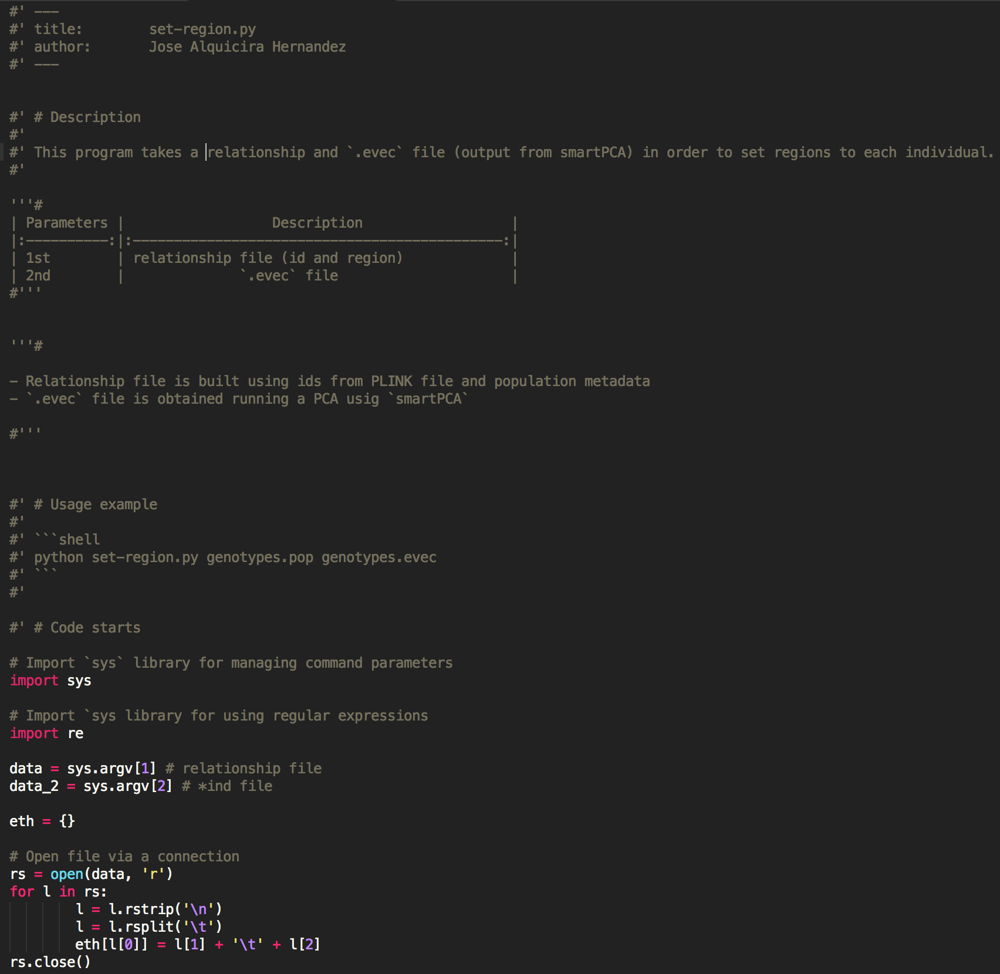
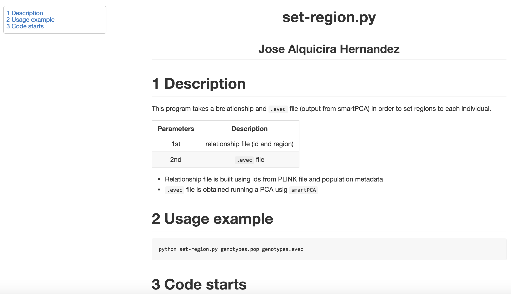

# Src2Markdown

# Description

`SrctoMarkdown.py` takes a script written in **python**, **perl**, **java**, **javascript**, **R** or **bash**
and generates a markdown document with comments processed as markdown text, and code embedded in
markdown code tags.

The output file is then converted into html, pdf, and other output formats supported by `Pandoc`.

This is an example of a script:



And this is the output:



See below for more details.  
You can see more examples on [this repository](https://github.com/joseah/SrcToMarkdown/tree/master/examples)

# Requirements

## Pandoc

This program requires [Pandoc](http://pandoc.org/) to convert the markdown output generated
with this program to any other format.

Download Pandoc from the [installing webpage](http://pandoc.org/installing.html).

**`SrctoMarkdown.py` is implemented under Pandoc version `1.17.0.2`**
 
## pypandoc

In order to use pandoc within python, pypandoc wrapper is required.

Install `pypandoc` via `pip`:

```bash
sudo pip install pypandoc
```

> See [pip webpage](https://pip.pypa.io/en/stable/installing/) if you do not use `pip` yet

**`SrctoMarkdown.py` is implemented under pypandoc version `1.2.0`**

# Parameter description


| Parameters |                  Description                   | Mandatory? |
|:----------:|:----------------------------------------------:|:----------:|
| -s         | script file (with comments in markdown style)  |Yes         |
| -o         |      output format (html, pdf, rst, ...)       |Yes         |
| -c         |                    css file                    |No          |
| -md        |            Write markdown output?              |No          |
| -pandoc    |Path to pandoc. Default `/usr/local/bin/pandoc` |No          |

# Usage example

```shell
python SrctoMarkdown.py -s functions.js -o html -c kult.css
```

Creates an html report for `functions.js`. A CSS file is used to give style to html output file.


# Comments on markdown style

## Perl, Bash, R

If you want to add a markdown comment, you have to use the `#'` pattern.
It tells `ScrtoMarkdown` that comments with this pattern at the beginning of 
each line will be processed as markdown text.


Example:

```Perl
#' # This is a title
#'
#' This is a comment in **markdown style**. *This text will be in italics!*.
#'
#' This is another paragraph. Still in markdown format.
#'
#' ## This is a subtitle
#' 
#' Last paragraph.
#'  

print "Hello world in Perl!";

# This is a normal comment in Perl and will not be considered as markdown text.

```


## Python


**Python** uses single-line and multiple-line comments.   

### Single-line comments 

For single-line comments, same rules mentioned for **Perl**, **Bash** and **R**.

### Multiple-line comments

Multiple-line comments are possible in **Python** using the `'''` pattern around text.  
In order to use markdown comments, use `'''#` and `#'''` tags around text.

Example: 

```python
'''#
# Outstanding title

This is a text formatted in **markdown**.
This text embedded in special tags to indicate it will be
processed as markdown text.


Fancy table:

| X | Y |
|:-:|--:|
| 1 | 2 |
| 3 | 4 |
| 5 | 8 |


#'''

print("This is a hello world in Python 3!!")

#' > Another markdown comment

```

## Java and Javascript

**Java** and **Javascript** share the same way to make comments.

### Single-line comments

Use `//'` pattern.

Example:

```java
//' This is a comment that will be processed as markdown text.
//' Another comment.

document.write("You can't see this!");

// This is a single line comment (not processed as markdown).
```

### Multiple-line comments

Use `/**` and `**/` tags around text.

Example:

```js
/**
# Sum function
**Overview**: Returns the sum of two numbers
Parameters:
- a: Numeric variable
- b: Numeric variable
## Example
result=sum(5, 10)
**/


function sum(a, b) {
    return a + b;
}
```
> Use `/**` and `**/` tags alone in single lines! **Do not include parts of markdown text in the same line**.

Example:

```js
/** # Sum function
**Overview**: Returns the sum of two numbers
Parameters:
- a: Numeric variable
- b: Numeric variable
## Example
result=sum(5, 10) **/
```


# Notes

This program is humbly inspired by the awesome work on *Knitr* by **Yihui Xie** and *Rmarkdown* by **JJ Allaire**.

# Contributors

- José Alquicira Hernández
